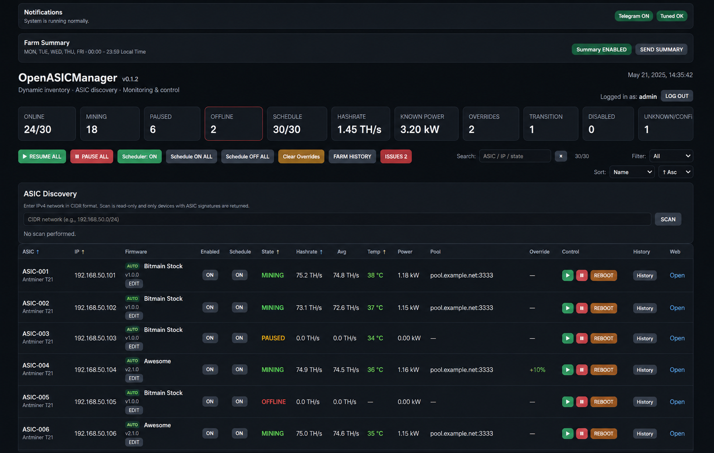

# OpenASICManager

OpenASICManager is a self-hosted web application for monitoring and controlling ASIC miners from a Linux server.

## Dashboard

The project was created as a lightweight alternative to heavyweight mining-management platforms where the main requirements are:

- centralized ASIC monitoring;
- scheduled start and pause operations;
- automatic firmware detection;
- manual firmware/driver override;
- telemetry and history;
- reboot and manual controls;
- anomaly detection;
- Telegram notifications;
- audit logging;
- optional secure access to the original ASIC web interface.

## Current release

**0.1.2**

This is the first public release.

The project has been primarily developed and tested with **Antminer T21** devices.

Validated firmware families:

- Bitmain Stock firmware;
- Awesome Miner / AnthillOS based firmware.

Other ASIC models or firmware may expose compatible APIs, but they have not yet been validated.

## Main features

### ASIC discovery

OpenASICManager can scan RFC1918 IPv4 networks and identify supported ASIC firmware automatically.

Example:

    ./scripts/asic-discover 192.168.1.0/24

Discovery is limited to private IPv4 networks.

### Automatic firmware detection

Managed ASICs may operate in two firmware-detection modes.

**AUTO**

OpenASICManager periodically detects the driver, model and firmware version.

**MANUAL**

Administrator values are preserved and automatic detection will not overwrite them.

### Scheduler

The scheduler supports editable rules with:

- PAUSE or RESUME action;
- arbitrary time;
- selectable weekdays;
- rule enable/disable;
- comments;
- per-ASIC Schedule ON/OFF.

Manual control temporarily overrides scheduling until the next scheduled transition.

### Monitoring

The dashboard provides information including:

- ASIC state;
- hashrate;
- average hashrate;
- temperature;
- power where supported;
- mining pool;
- model;
- firmware;
- last error;
- scheduler state.

Telemetry availability depends on ASIC firmware.

### Control

Supported operations include:

- Resume mining;
- Pause mining;
- Reboot ASIC;
- enable/disable management;
- enable/disable scheduling.

Control operations are verified asynchronously rather than treated as successful only because an HTTP request returned successfully.

### History and anomaly detection

OpenASICManager stores telemetry snapshots and event history.

Current anomaly logic includes conditions such as:

- ASIC offline;
- excessive temperature;
- scheduler state mismatch.

### Telegram

Optional Telegram notifications can report important ASIC events and farm summaries.

Telegram is disabled by default.

### Remote ASIC Web

Remote Web allows an authenticated user of OpenASICManager to open the original web interface of a managed ASIC through nginx.

The feature is optional and disabled by default.

Example hostname:

    192.168.1.81
        |
        v
    m192-168-1-81.manager.example.com

Remote Web uses:

- HTTPS;
- signed short-lived session cookies;
- nginx `auth_request`;
- access validation by OpenASICManager;
- Digest Authorization passthrough for Bitmain firmware.

## Architecture

    Browser
       |
      HTTPS
       |
    nginx + Basic Auth
       |
       v
    OpenASICManager
       |
       +---- SQLite
       |
       +---- ASIC network
       |       |
       |       +-- Bitmain Stock
       |       +-- Awesome / AnthillOS
       |
       +---- Telegram (optional)
       |
       +---- Remote ASIC Web (optional)

OpenASICManager itself listens on:

    127.0.0.1:8088

and is intended to be published through nginx.

## Requirements

Recommended platform:

- Ubuntu 24.04 LTS;
- Python 3;
- systemd;
- nginx for public HTTPS access.

Python dependencies:

- FastAPI;
- Uvicorn;
- Requests;
- PySocks.

## Quick start

Clone the repository and run:

    git clone https://github.com/amihfil-beep/OpenASICManager.git
    cd OpenASICManager
    sudo ./install.sh

Then configure:

    /etc/openasicmanager/openasicmanager.env

At minimum, configure the credentials required by your ASIC firmware.

Restart:

    sudo systemctl restart openasicmanager

Check:

    curl http://127.0.0.1:8088/health

For public HTTPS access:

    sudo ./configure-web.sh \
        --domain manager.example.com \
        --email admin@example.com \
        --user admin

See [INSTALL.md](INSTALL.md) for complete installation instructions.

## Security

OpenASICManager intentionally does not include default ASIC passwords.

Passwords, Telegram tokens, Remote Web secrets and other deployment-specific values must be supplied through:

    /etc/openasicmanager/openasicmanager.env

The real environment file must never be committed to Git.

The application service runs under a dedicated unprivileged account.

The default systemd deployment also uses:

- `NoNewPrivileges=true`;
- `PrivateTmp=true`;
- `ProtectSystem=strict`;
- `ProtectHome=true`;
- restrictive umask.

## Project status

OpenASICManager is currently a pet/open-source project and should be considered an early release.

Before deploying it to a production mining environment, test control operations and scheduling with a small subset of devices.

## Documentation

- [Installation](INSTALL.md)
- [Architecture](docs/ARCHITECTURE.md)
- [Remote ASIC Web](docs/REMOTE-WEB.md)
- [Changelog](CHANGELOG.md)

## Roadmap

Planned areas of development include:

- support for additional ASIC models and firmware families;
- modular driver architecture;
- improved telemetry and historical charts;
- configurable alert policies;
- improved multi-subnet discovery and inventory management;
- automated Remote Web configuration updates;
- additional authentication options;
- API documentation;
- automated upgrade and uninstall tooling.

Feature development will prioritize safe operation and compatibility with
real ASIC hardware over adding large numbers of untested features.

## License

MIT License. See [LICENSE](LICENSE).
